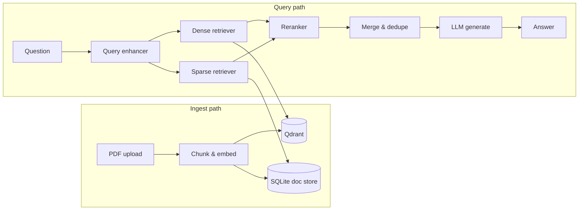

# Semantic Search — Hybrid RAG API

A FastAPI service for **retrieval-augmented generation (RAG)** over PDF documents. It combines **dense** vector search (embeddings in Qdrant) with **sparse** keyword search (BM25 over SQLite), then uses an LLM to answer questions from the retrieved context.

Built as a learning and experimentation platform for hybrid retrieval, query rewriting, reranking, and multi-provider LLM integration.

## Features

- **PDF ingestion** — upload PDFs, chunk text, embed with [sentence-transformers](https://www.sbert.net/), and index in Qdrant
- **Hybrid retrieval** — dense (semantic) + sparse (BM25) search, merged and reranked before generation
- **Query enhancement** — optional LLM rewrite of user questions for better retrieval
- **LLM reranking** — score and reorder candidates with the configured model
- **Retriever comparison** — side-by-side dense vs sparse results, with optional LLM relevance scoring
- **Multi-provider LLMs** — OpenAI, Google Gemini, or OpenRouter (switch via config)
- **Prompt templates** — reusable `.txt` templates for QA, summarization, and extraction
- **Utilities** — token counting, self-consistency sampling, LangSmith tracing

## Architecture



| Component | Role |
|-----------|------|
| **Qdrant** | Vector store for dense (semantic) retrieval |
| **SQLite** | Chunk metadata and text for BM25 sparse retrieval |
| **HuggingFace embeddings** | Default: `sentence-transformers/all-MiniLM-L6-v2` |
| **LLM provider** | Answer generation, query enhancement, reranking, comparisons |

## Prerequisites

- Python 3.11+
- [Qdrant](https://qdrant.tech/) running locally (default: `http://localhost:6333`)
- API key for your chosen LLM provider

## Quick start

### 1. Clone and install

```bash
git clone <repo-url>
cd semantic-search
python -m venv .venv
source .venv/bin/activate   # Windows: .venv\Scripts\activate
pip install -r requirements.txt
```

### 2. Start Qdrant

```bash
docker run -p 6333:6333 qdrant/qdrant
```

### 3. Configure environment

Create a `.env` file in the project root:

```env
# LLM provider: openai | gemini | openrouter
LLM_PROVIDER=openrouter

# Provider keys (set the one you use)
OPENROUTER_API_KEY=your-key-here
OPENROUTER_MODEL=openai/gpt-oss-120b:free

# OPENAI_API_KEY=...
# OPENAI_MODEL=gpt-4o

# GEMINI_API_KEY=...
# GEMINI_MODEL=gemini-3-flash-preview

# Vector store
QDRANT_URL=http://localhost:6333
QDRANT_COLLECTION_NAME=semantic-search

# Optional
DATABASE_URL=sqlite:///./docstore.db
EMBEDDING_MODEL_NAME=sentence-transformers/all-MiniLM-L6-v2
LANGSMITH_TRACING=false
LANGSMITH_API_KEY=
```

### 4. Run the API

```bash
uvicorn app.main:app --reload
```

Open interactive docs at [http://127.0.0.1:8000/docs](http://127.0.0.1:8000/docs).

### 5. Run the web UI (optional)

In a second terminal, start the TanStack Start frontend (proxies API calls to port 8000 in dev):

```bash
cd web
pnpm install
pnpm dev
```

Open [http://localhost:3000](http://localhost:3000) for **Ingest**, **Ask**, and **Tools** pages.

For production builds, set `VITE_API_URL` to your public API origin and add that UI origin to `CORS_ORIGINS` in the API `.env` (default: `http://localhost:3000`).

Example `web/.env`:

```env
VITE_API_URL=http://127.0.0.1:8000
```

### 6. Ingest a document and ask a question

```bash
# Upload a PDF
curl -X POST http://127.0.0.1:8000/ingest \
  -F "file=@./your-document.pdf"

# Ask a question (hybrid RAG pipeline)
curl -X POST http://127.0.0.1:8000/ask \
  -H "Content-Type: application/json" \
  -d '{"question": "What are the main findings?"}'
```

## API overview

| Method | Path | Description |
|--------|------|-------------|
| `GET` | `/health` | Health check |
| `POST` | `/ingest` | Upload and index a PDF |
| `POST` | `/ask` | Full RAG: enhance → retrieve → rerank → generate |
| `POST` | `/enhance` | Rewrite a query for retrieval (standalone) |
| `POST` | `/compare` | Compare dense vs sparse retriever results |
| `POST` | `/compare/llm` | Same as `/compare`, plus LLM relevance scores |
| `POST` | `/llm/test` | Send a raw prompt to the configured LLM |
| `POST` | `/prompt/test` | Render a template and call the LLM |
| `POST` | `/self-consistency` | Sample multiple answers and pick the best |
| `POST` | `/tokens/count` | Tokenize text and return token count |

### Request examples

**Ask (RAG)**

```json
POST /ask
{ "question": "Summarize the methodology section." }
```

**Compare retrievers**

```json
POST /compare
{ "question": "revenue growth", "top_k": 5 }
```

**Test a prompt template**

```json
POST /prompt/test
{
  "template": "qa_over_context",
  "variables": {
    "context": "...",
    "question": "..."
  }
}
```

Available templates live in `app/prompt_templates/`: `qa_over_context`, `qa_cot`, `summarization`, `structured_extraction`.

## Project structure

```
web/                     # TanStack Start UI (Ingest, Ask, Tools)
app/
├── main.py              # FastAPI app & router registration
├── config.py            # Settings (env / .env)
├── dependencies.py      # DI wiring for services
├── routers/             # HTTP endpoints
├── services/            # Business logic (ingest, query, compare, rerank, …)
├── db/                  # SQLite document store & Qdrant vector store
├── llm/                 # Provider adapters (OpenAI, Gemini, OpenRouter)
├── schemas/             # Pydantic request/response models
├── prompt_templates/    # LLM prompt files
└── utils/               # Chunking, prompts, tokenization, IDs

tests/                   # Pytest unit tests
docs/improvement-plan.md # Roadmap toward production hybrid RAG
```

## How `/ask` works

1. **Enhance** — the query enhancer may rewrite the question for clearer retrieval.
2. **Retrieve** — dense search hits Qdrant; sparse search builds a BM25 index from SQLite chunks.
3. **Rerank** — each channel’s candidates are scored by the LLM (with timeout fallback to raw order).
4. **Merge** — results are deduplicated by content and combined.
5. **Generate** — a prompt is built from context + question and sent to the configured LLM.

## Development

### Install dev dependencies

```bash
pip install -r requirements-dev.txt
```

### Run tests

```bash
pytest
```

### Configuration reference

| Variable | Default | Description |
|----------|---------|-------------|
| `LLM_PROVIDER` | `openrouter` | `openai`, `gemini`, or `openrouter` |
| `QDRANT_URL` | `http://localhost:6333` | Qdrant HTTP endpoint |
| `QDRANT_COLLECTION_NAME` | `semantic-search` | Collection name |
| `DATABASE_URL` | `sqlite:///./docstore.db` | Chunk metadata store |
| `EMBEDDING_MODEL_NAME` | `all-MiniLM-L6-v2` | HuggingFace embedding model |
| `ENHANCER_MODEL` | _(provider default)_ | Override model for query enhancement |
| `ENABLE_REASONING` | `false` | Enable reasoning mode where supported |
| `LANGSMITH_TRACING` | `true` | Enable LangSmith when API key is set |
| `DEFAULT_TENANT_ID` | `default` | Tenant namespace for multi-tenant prep |
| `CORS_ORIGINS` | `http://localhost:3000` | Comma-separated browser origins allowed to call the API |

## Roadmap

See [docs/improvement-plan.md](docs/improvement-plan.md) for planned improvements: async ingest jobs, persistent sparse indexes, RRF fusion, idempotent upserts, and clearer ingest vs query API boundaries.

