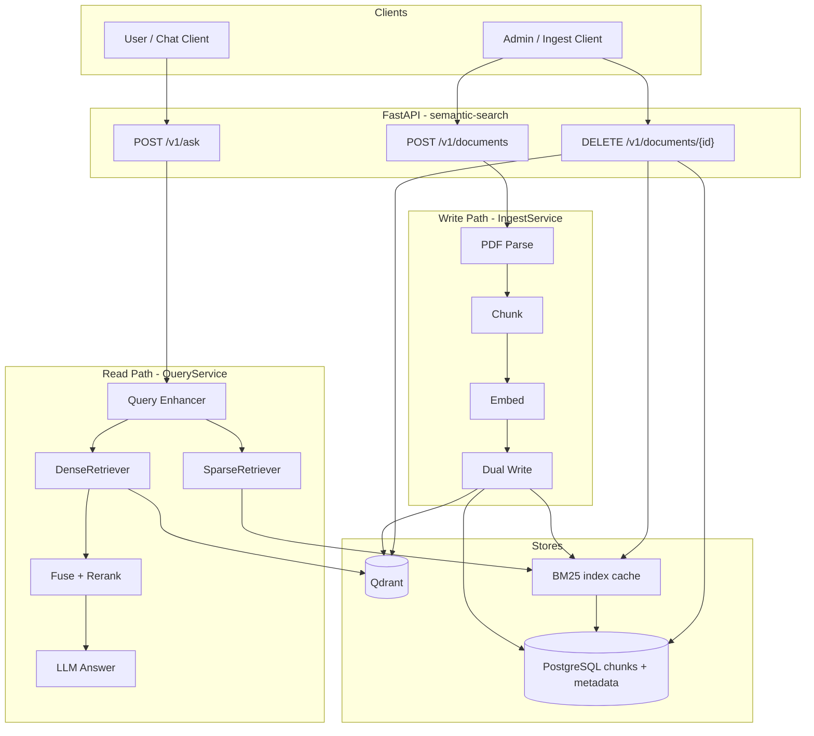

# Hybrid RAG: Ingest/Query Separation & Data Lifecycle

Plan for evolving **semantic-search** from a monolithic prototype into a production-style hybrid RAG system with clear ingest vs query boundaries and document lifecycle management.

---

## How production hybrid RAG systems separate ingestion and query

Most production systems separate along **four axes**, not just two endpoints.

### 1. API / responsibility split

| Layer | Ingest (write path) | Query (read path) |
|--------|---------------------|-------------------|
| **Purpose** | Parse, chunk, embed, index | Retrieve, fuse, rerank, generate |
| **Latency** | Seconds–minutes (async) | Sub-second to a few seconds |
| **Scaling** | CPU-heavy workers, batch-friendly | Low-latency, read-optimized |
| **Failure mode** | Retry jobs, dead-letter queue | Degrade (skip rerank, return partial) |

**Patterns seen in the wild:**

- **Monolith with clear modules** ([Hybrid-RAG-example](https://github.com/FullFran/Hybrid-RAG-example)): `IngestService` vs `RAGService` in one repo, separate classes and routes.
- **Microservices** ([OPEA HybridRAG](https://opea-project.github.io/latest/GenAIExamples/HybridRAG/README.html)): Data Preparation → Embedding → Retrieval → Reranker → LLM, orchestrated by a gateway; ingest never blocks query.
- **Backend + thin clients** ([flexible-graphrag](https://github.com/stevereiner/flexible-graphrag/blob/main/docs/ARCHITECTURE.md)): FastAPI backend with `POST /api/ingest` (returns `processing_id` immediately) vs `POST /api/search` and `POST /api/query`; MCP/UI call the same HTTP API.

Typical ingest flow:

```
Upload → job queued → parse → chunk → embed → write vector DB + sparse index → status API
```

Typical query flow:

```
Question → (optional rewrite) → dense + sparse retrieve → RRF/fusion → rerank → LLM
```

### 2. Runtime split (for customers or tiers)

| Model | When used |
|--------|-----------|
| **Same process, different routes** | Prototypes, single-tenant |
| **Ingest worker + query API** | Production; ingest spikes don't starve `/ask` |
| **Collection / namespace per tenant** | SaaS: `tenant_{id}` in Qdrant + metadata filter |
| **Separate vector collections per customer** | Strong isolation, higher ops cost |

Query services are usually **read-only** on vector/sparse stores; they never parse PDFs or run heavy embedding batches on the request thread.

### 3. Index split (hybrid retrieval)

Hybrid RAG maintains **two retrieval indexes** tied by a **shared chunk identity**:

| Index | Current stack | Production pattern |
|--------|---------------|-------------------|
| Dense | Qdrant | Same, with `doc_id` + `chunk_id` in payload |
| Sparse | PostgreSQL + BM25 rebuilt every `/ask` | Persistent BM25 (or OpenSearch/ES), or prebuilt inverted index |
| Fusion | Manual dedupe by `page_content` | RRF or weighted score merge on stable IDs |

**Rule:** one logical chunk ID in both stores so delete/update/replace stay consistent.

### 4. Customer-facing surface

Products usually expose:

- **Admin / ingest API**: upload, list docs, delete, reindex, job status (API keys, higher rate limits).
- **User / query API**: `/ask`, `/search` only (no ingest; often scoped by `tenant_id` or collection).

Auth and routing enforce that split even when both live in one FastAPI app initially.

---

## How systems handle add, update, and remove

### Adding documents

| Approach | Behavior |
|----------|----------|
| **Append-only** | Simple; duplicates on re-upload |
| **Idempotent upsert** | Content hash per chunk; skip unchanged |
| **Incremental indexing** | [LangChain `index()` + `SQLRecordManager`](https://reference.langchain.com/python/langchain-community/indexes/_sql_record_manager/SQLRecordManager): tracks hashes, supports `cleanup="incremental"` |
| **Replace document** | Delete all chunks for `doc_id`, then ingest new version |

### Updating documents

Common pattern: **delete-by-document-id, then re-ingest** (simplest and correct when chunk boundaries may change).

Alternatives:

- **Chunk-level hash diff**: only re-embed changed chunks (cheaper at scale).
- **Version field** in metadata: query filters `version = latest` until background reindex finishes.

### Removing documents

| Strategy | Use when |
|----------|----------|
| **Hard delete** | GDPR, explicit user delete; remove from Qdrant + PostgreSQL (and BM25 cache) by `doc_id` |
| **Tombstone** | Large pipelines; mark deleted, async cleanup |
| **Full reindex** | Rare; migration or corruption recovery |

**Production pitfall:** deleting only PostgreSQL or only Qdrant leaves **orphan vectors** or **ghost BM25 hits**. Deletes must be **multi-store and keyed by the same ID**.

### Operational extras

- **Job status**: `processing_id`, progress, failure reason.
- **Index freshness**: metric for lag between source update and searchable index.
- **Reconciliation job**: periodic scan for chunks in PostgreSQL without Qdrant points (or vice versa).

---

## Current state of this application

Logical split exists (`POST /ingest` vs `POST /ask`) but not a production split.

| Area | Status |
|------|--------|
| Ingest | `POST /ingest` — PDF only, dual-write to Qdrant + PostgreSQL |
| Query | `POST /ask` — dense + sparse + rerank + LLM |
| IDs | No shared `document_id` / `chunk_id` across Qdrant and PostgreSQL |
| Delete / update | None |
| Re-ingest | Append-only; duplicates corpora |
| BM25 | Rebuilt from all PostgreSQL chunks on every `/ask` |
| Config | Qdrant URL/collection hardcoded in `vector_store.py` |
| Dual write | No transaction; partial failure can desync stores |

Key files today:

- `app/main.py` — routes and orchestration
- `app/db/vector_store.py` — Qdrant dense index
- `app/db/document_store.py` — PostgreSQL chunks for BM25
- `app/services/dense_retriever.py`, `sparse_retriever.py` — retrieval
- `app/services/query_enhancer.py`, `re_ranker.py`, `llm_service.py` — query pipeline

---

## Proposed plan (phased)

### Phase 0 — Data model & identity (foundation)

Introduce stable IDs everywhere:

```
document_id  (UUID per uploaded PDF / logical doc)
chunk_id     (document_id + chunk_index, or UUID per chunk)
tenant_id    (optional; default "default" for single-tenant)
```

**Schema changes:**

- PostgreSQL `document_chunks`: add `document_id`, `chunk_id` (unique), optional `content_hash`, `ingested_at`, `status` (`active` | `deleted`).
- Qdrant payload: `{ document_id, chunk_id, source, chunk_index, tenant_id }`.
- Use **the same `chunk_id`** as the Qdrant point ID where possible.

**Config:** move `QDRANT_URL`, `COLLECTION_NAME` into `Settings` (env-driven).

### Phase 1 — Lifecycle APIs (same monolith, clear boundaries)

Split `main.py` orchestration into services:

| Module | Responsibility |
|--------|----------------|
| `IngestService` | parse → chunk → dual write → return job result |
| `QueryService` | enhance → retrieve → fuse → rerank → answer |
| `IndexAdminService` | delete / replace / list documents |

**New endpoints:**

| Endpoint | Purpose |
|----------|---------|
| `POST /v1/documents` | Ingest |
| `GET /v1/documents` | List ingested docs + chunk counts |
| `GET /v1/documents/{document_id}` | Status / metadata |
| `DELETE /v1/documents/{document_id}` | Remove from Qdrant + PostgreSQL |
| `PUT /v1/documents/{document_id}` | Replace (= delete + ingest) |
| `POST /v1/ask` | Query only |

**Delete implementation:**

1. `DELETE FROM document_chunks WHERE document_id = ?`
2. Qdrant `delete` with filter on `document_id`
3. Invalidate sparse index cache (Phase 2)

**Ingest idempotency:** same `document_id` + unchanged content hash → skip; hash changed → replace.

### Phase 2 — Performance & async ingest

| Item | Change |
|------|--------|
| **Persistent sparse index** | Build BM25 on ingest completion; store serialized index or PostgreSQL full-text search |
| **Async ingest** | `POST /documents` returns `job_id`; `GET /jobs/{job_id}` for status |
| **Optional queue** | Redis + worker, or in-process `asyncio` + DB job table for MVP |

Query path must **not** call `list_chunks()` + full BM25 build on every request.

### Phase 3 — Multi-tenant / customers (if needed)

- `tenant_id` on every chunk and Qdrant payload.
- Per-tenant collection **or** single collection + mandatory metadata filter on retrieve.
- API keys scoped to tenant; ingest and query both filter by `tenant_id`.

### Phase 4 — Production hardening (optional)

- LangChain `SQLRecordManager` + `index(cleanup="incremental")` for hash-based incremental sync.
- Reconciliation cron: detect orphan vectors.
- Split deploy: **ingest worker** (write) vs **query API** (read-only Qdrant + loaded BM25).
- Observability: ingest duration, index size, query latency, stale index age.

---

## Target architecture



---

## Recommended implementation order

| Step | Effort | Impact |
|------|--------|--------|
| 1. `document_id` / `chunk_id` in PostgreSQL + Qdrant payload | Medium | Unblocks delete/replace |
| 2. `DELETE /v1/documents/{id}` dual-store | Medium | Fixes biggest lifecycle gap |
| 3. Extract `IngestService` / `QueryService` | Low–medium | Clean separation in code |
| 4. Persistent BM25 (build on ingest) | Medium | Fixes query scalability |
| 5. Replace = delete + ingest on `PUT` | Low | Safe updates |
| 6. Async jobs + status endpoint | Medium | Production ingest UX |
| 7. `tenant_id` + collection config | Medium | Multi-customer |

---

## Decisions to make before implementation

1. **Single-tenant vs multi-tenant** — affects collection strategy and auth.
2. **Replace semantics** — full document replace only, or partial page updates?
3. **Async ingest now or later** — depends on PDF size and expected concurrency.
4. **Sparse index** — stay on PostgreSQL+BM25 with cache, or move to OpenSearch/Elasticsearch later.
5. **Backward compatibility** — keep `/ingest` and `/ask` as aliases during migration?

---

## References

- [OPEA HybridRAG](https://opea-project.github.io/latest/GenAIExamples/HybridRAG/README.html) — microservice decomposition
- [flexible-graphrag architecture](https://github.com/stevereiner/flexible-graphrag/blob/main/docs/ARCHITECTURE.md) — async ingest + separate search/query APIs
- [LangChain SQLRecordManager](https://reference.langchain.com/python/langchain-community/indexes/_sql_record_manager/SQLRecordManager) — incremental indexing and cleanup
- [Hybrid-RAG-example](https://github.com/FullFran/Hybrid-RAG-example) — IngestService vs RAGService in one codebase
